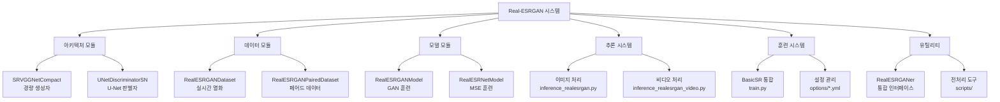

# Real-ESRGAN 프로젝트 Claude 작업 가이드

# 📚 문서 연결성 (Document Hierarchy)

**📍 현재 위치**: L0 - 프로젝트 최상위 가이드
**📂 하위 문서 (Level 1)**:
- [L1 - 추론 시스템 가이드](./inference_context.md) - 이미지/비디오 처리 추론 시스템
- [L1 - 스크립트 시스템 가이드](./scripts/scripts_context.md) - 데이터 전처리 및 변환 도구
- [L1 - 옵션 설정 가이드](./options/options_context.md) - 훈련 설정 및 하이퍼파라미터
- [L1 - 테스트 시스템 가이드](./tests/TESTS.md) - 단위 테스트 및 검증

**🏗️ 하위 문서 (Level 2)**:
- [L2 - RealESRGANer 패키지 가이드](./realesrgan/realesrgan_context.md) - 핵심 패키지 시스템
- [L2 - 아키텍처 분석](./realesrgan/archs/archs_context.md) - 신경망 구조 설계
- [L2 - 데이터 시스템](./realesrgan/data/data_context.md) - 데이터 로딩 및 증강
- [L2 - 모델 시스템](./realesrgan/models/models_context.md) - 훈련 및 손실 함수

---

이 문서는 Real-ESRGAN 프로젝트에서 Claude와 협업할 때 따라야 할 필수 가이드라인과 기술 문서 활용 방법을 제시합니다.

---

## 1. 📢 한국어 커뮤니케이션 필수 사항

### 🎯 기본 원칙
- **모든 대화와 작업은 한국어로 수행**합니다
- 기술적 용어는 **한국어 번역과 함께 영어 원어를 병기**합니다
  - 예: 초해상도(Super-Resolution), 생성적 적대 신경망(GAN), 합성곱 신경망(CNN)
- 코드 주석과 문서화는 **한국어를 우선**으로 작성합니다

### 🔍 용어 표준화
| 영어 | 한국어 | 사용 예시 |
|------|--------|-----------|
| Super-Resolution | 초해상도 | 초해상도(Super-Resolution) |
| Real-world | 실세계 | 실세계(Real-world) 이미지 |
| Blind | 블라인드 | 블라인드(Blind) 초해상도 |
| Degradation | 열화/품질 저하 | 이미지 열화(Degradation) |
| Enhancement | 향상/복원 | 이미지 향상(Enhancement) |
| Inference | 추론 | 추론(Inference) 과정 |
| Training | 훈련 | 모델 훈련(Training) |
| Fine-tuning | 미세조정 | 미세조정(Fine-tuning) |

### 📝 문서화 표준
- **제목**: 한국어 + (영어) 병기
- **설명**: 한국어 위주, 필요시 영어 보완
- **코드 주석**: 한국어 설명 + 영어 기술 용어
- **에러 메시지**: 한국어 해석과 해결 방안 제시

---

## 2. 🤝 사용자와의 협의 기반 작업 필수

### ✅ 작업 시작 전 확인사항
1. **작업 범위 명확화**
   - 수정할 파일 범위 확인
   - 예상 소요 시간 및 복잡도 안내
   - 의존성 및 영향 범위 설명

2. **사용자 요구사항 확인**
   - 구체적인 기능 요구사항
   - 성능 및 품질 기준
   - 호환성 요구사항

3. **작업 방향 합의**
   - 구현 방식 옵션 제시
   - 장단점 비교 설명
   - 최종 선택 확인

### 🔄 작업 진행 중 협의
- **중간 체크포인트**: 주요 단계별 진행 상황 보고
- **변경 사항 발생**: 즉시 사용자와 협의
- **문제 발생**: 해결 방안 옵션 제시 후 선택 요청

### 📊 작업 완료 시 보고
- **완료된 작업 내역**: 구체적인 변경 사항
- **테스트 결과**: 동작 확인 및 성능 측정
- **추가 권장사항**: 최적화 방법이나 주의사항

---

## 3. 📁 Context 문서 활용 가이드

### 🗂️ 문서 구조 및 위치

#### **루트 레벨 문서**
```
C:\Program Files\Real-ESRGAN\
├── inference_context.md           # 추론 스크립트 종합 가이드
├── CLAUDE.md                     # 본 문서 (Claude 작업 가이드)
└── README_KR.md                  # 프로젝트 개요 (한국어)
```

#### **모듈별 Context 문서**
```
realesrgan/
├── realesrgan_context.md         # 패키지 전체 컨텍스트
├── archs/archs_context.md        # 신경망 아키텍처
├── data/data_context.md          # 데이터 로딩 시스템  
└── models/models_context.md      # 훈련 모델 시스템

scripts/
└── scripts_context.md            # 데이터 전처리 스크립트

options/
└── options_context.md            # 훈련 설정 옵션
```

### 📖 각 Context 문서의 역할과 활용법

#### **1. inference_context.md** 📍 `./inference_context.md`
**역할**: 추론 및 실행 가이드
```markdown
포함 내용:
- inference_realesrgan.py (이미지 처리)
- inference_realesrgan_video.py (비디오 처리)
- 매개변수 옵션, 사용 예시, 성능 최적화
```
**활용 시기**: 
- 이미지/비디오 처리 질문 시
- 추론 성능 최적화 필요 시
- 명령어 사용법 문의 시

#### **2. realesrgan_context.md** 📍 `./realesrgan/realesrgan_context.md`
**역할**: 패키지 전체 시스템 이해
```markdown
포함 내용:
- 패키지 구조, 핵심 유틸리티 (RealESRGANer)
- 훈련 스크립트, 버전 관리
- 하위 모듈 통합, 확장성 가이드
```
**활용 시기**:
- 패키지 전체 구조 이해 필요 시
- RealESRGANer 클래스 커스터마이징 시
- 새로운 기능 추가 계획 시

#### **3. archs_context.md** 📍 `./realesrgan/archs/archs_context.md`  
**역할**: 신경망 아키텍처 상세 분석
```markdown
포함 내용:
- SRVGGNetCompact (생성자)
- UNetDiscriminatorSN (판별자)
- 아키텍처 비교, 성능 특성
```
**활용 시기**:
- 새로운 아키텍처 추가 시
- 모델 성능 분석 필요 시
- 아키텍처 수정 작업 시

#### **4. data_context.md** 📍 `./realesrgan/data/data_context.md`
**역할**: 데이터 로딩 및 증강 시스템
```markdown
포함 내용:
- RealESRGANDataset (실시간 열화)
- RealESRGANPairedDataset (페어드 데이터)
- 데이터 증강 파이프라인
```
**활용 시기**:
- 커스텀 데이터셋 구성 시
- 데이터 증강 방식 수정 시
- 훈련 데이터 문제 해결 시

#### **5. models_context.md** 📍 `./realesrgan/models/models_context.md`
**역할**: 훈련 모델 및 손실 함수
```markdown
포함 내용:
- RealESRGANModel (GAN 훈련)
- RealESRNetModel (MSE 훈련)
- 손실 함수, 최적화 전략
```
**활용 시기**:
- 훈련 설정 수정 시
- 새로운 손실 함수 추가 시
- 훈련 문제 디버깅 시

#### **6. scripts_context.md** 📍 `./scripts/scripts_context.md`
**역할**: 데이터 전처리 도구
```markdown
포함 내용:
- 이미지 추출 (extract_subimages.py)
- 메타정보 생성 (generate_meta_info*.py)
- 모델 변환 (pytorch2onnx.py)
```
**활용 시기**:
- 데이터 전처리 작업 시
- 새로운 데이터셋 준비 시
- 모델 배포 준비 시

#### **7. options_context.md** 📍 `./options/options_context.md`
**역할**: 훈련 설정 옵션
```markdown
포함 내용:
- 훈련용 YAML 파일들
- 미세조정 설정
- 하이퍼파라미터 가이드
```
**활용 시기**:
- 훈련 설정 수정 시
- 새로운 실험 구성 시
- 성능 튜닝 필요 시

### 🔗 Context 문서 통합 활용 전략

#### **계층적 접근법**
1. **상위 레벨**: `realesrgan_context.md` → 전체 이해
2. **중간 레벨**: 관련 모듈 context → 세부 기능 파악  
3. **하위 레벨**: 개별 파일 주석 → 구체적 구현

#### **작업 유형별 참조 순서**

**🔧 새로운 모델 추가**
```
1. realesrgan_context.md (전체 구조)
2. archs_context.md (아키텍처 추가)
3. models_context.md (모델 클래스 구현)
4. options_context.md (설정 파일 생성)
```

**📊 데이터셋 커스터마이징**
```
1. data_context.md (데이터 시스템 이해)
2. scripts_context.md (전처리 도구)
3. realesrgan_context.md (통합 테스트)
```

**🚀 성능 최적화**
```
1. inference_context.md (추론 최적화)
2. models_context.md (훈련 최적화)
3. data_context.md (데이터 로딩 최적화)
```

#### **검색 및 참조 가이드**

**키워드별 참조 문서**
| 키워드 | 우선 참조 문서 | 추가 참조 |
|--------|----------------|-----------|
| 추론, inference | inference_context.md | realesrgan_context.md |
| 훈련, training | models_context.md | options_context.md |
| 데이터셋, dataset | data_context.md | scripts_context.md |
| 아키텍처, network | archs_context.md | models_context.md |
| 설정, config | options_context.md | models_context.md |
| 유틸리티, utils | realesrgan_context.md | inference_context.md |

---

## 4. 📚 전체 기술 문서 개관

### 🎯 프로젝트 핵심 개념

**Real-ESRGAN**은 실세계 이미지의 블라인드 초해상도를 위한 GAN 기반 시스템입니다.

#### **핵심 기술 스택**
- **딥러닝 프레임워크**: PyTorch + BasicSR
- **아키텍처**: GAN (Generator + Discriminator)
- **훈련 방식**: 2단계 파이프라인 (ESRNet → ESRGAN)
- **데이터 증강**: 실시간 열화 시뮬레이션

#### **주요 컴포넌트**
1. **생성자 네트워크**: RRDBNet, SRVGGNetCompact
2. **판별자 네트워크**: UNetDiscriminatorSN  
3. **데이터 시스템**: 실시간 열화 + 페어드 데이터셋
4. **훈련 시스템**: GAN + MSE 기반 2단계 훈련
5. **추론 시스템**: 이미지 + 비디오 처리

### 🏗️ 시스템 아키텍처



### 📊 성능 및 품질 지표

#### **정량적 지표**
- **PSNR**: 픽셀 레벨 정확도
- **SSIM**: 구조적 유사도
- **LPIPS**: 지각적 유사도  
- **FID**: 생성 품질 평가

#### **정성적 평가**
- **시각적 선명도**: 텍스처 복원 품질
- **아티팩트 수준**: 생성 노이즈 정도
- **현실성**: 자연스러운 이미지 생성

### 🎛️ 주요 하이퍼파라미터

#### **아키텍처 설정**
| 파라미터 | 기본값 | 설명 |
|----------|--------|------|
| num_feat | 64 | 특징 채널 수 |
| num_conv | 32/16 | 합성곱 레이어 수 |
| upscale | 4/2 | 업스케일링 배율 |

#### **훈련 설정**
| 파라미터 | 기본값 | 설명 |
|----------|--------|------|
| batch_size | 12 | 배치 크기 |
| lr_g | 2e-4 | 생성자 학습률 |
| lr_d | 2e-4 | 판별자 학습률 |
| pixel_opt.loss_weight | 1.0 | L1 손실 가중치 |
| perceptual_opt.loss_weight | 1.0 | VGG 손실 가중치 |
| gan_opt.loss_weight | 0.1 | GAN 손실 가중치 |

#### **데이터 증강 설정**
| 파라미터 | 기본값 | 설명 |
|----------|--------|------|
| blur_kernel_size | 21 | 블러 커널 크기 |
| resize_range | [0.15, 1.5] | 크기 조정 범위 |
| noise_range | [1, 30] | 노이즈 강도 |
| jpeg_range | [30, 95] | JPEG 압축 품질 |

### 🔬 고급 기능

#### **DNI (Deep Network Interpolation)**
- **목적**: 노이즈 제거 강도 조절
- **구현**: 두 모델의 가중 평균
- **사용법**: `--denoise_strength 0.5`

#### **타일 처리 (Tile Processing)**  
- **목적**: GPU 메모리 절약
- **방식**: 이미지 분할 처리
- **권장 크기**: 400-800 (GPU 메모리에 따라)

#### **얼굴 향상 (Face Enhancement)**
- **기술**: GFPGAN 통합
- **용도**: 인물 사진 품질 향상
- **한계**: 애니메이션에는 비효과적

### 🛠️ 개발 및 커스터마이징 가이드

#### **새로운 아키텍처 추가**
1. `realesrgan/archs/` 폴더에 `*_arch.py` 파일 생성
2. `@ARCH_REGISTRY.register()` 데코레이터 사용
3. BasicSR의 베이스 클래스 상속

#### **새로운 데이터셋 추가**
1. `realesrgan/data/` 폴더에 `*_dataset.py` 파일 생성  
2. `@DATASET_REGISTRY.register()` 데코레이터 사용
3. `torch.utils.data.Dataset` 상속

#### **새로운 모델 추가**
1. `realesrgan/models/` 폴더에 `*_model.py` 파일 생성
2. `@MODEL_REGISTRY.register()` 데코레이터 사용
3. BasicSR의 BaseModel 상속

### 📈 성능 최적화 전략

#### **메모리 최적화**
- **타일 처리**: 대용량 이미지 분할 처리
- **FP16**: 반정밀도 연산으로 메모리 절약
- **그래디언트 체크포인팅**: 메모리-연산 트레이드오프

#### **속도 최적화**  
- **TensorRT**: 추론 가속화
- **ONNX**: 플랫폼 독립적 배포
- **멀티스레딩**: CPU 병렬 처리

#### **품질 최적화**
- **앙상블**: 여러 모델 결과 조합
- **후처리**: 샤프닝, 색상 보정
- **도메인 특화**: 애니메이션/사진별 모델

### 🔍 문제 해결 가이드

#### **일반적인 문제들**

**1. CUDA out of memory**
```bash
# 해결방안: 타일 크기 축소
python inference_realesrgan.py -i input.jpg -o output.jpg -t 400
```

**2. 모델 로딩 실패**  
```bash
# 해결방안: 모델 경로 확인
python inference_realesrgan.py -i input.jpg --model_path weights/RealESRGAN_x4plus.pth
```

**3. 지원하지 않는 이미지 형식**
```bash
# 해결방안: 형식 변환 후 처리
convert input.webp input.png
python inference_realesrgan.py -i input.png
```

#### **성능 문제 해결**
- **느린 처리 속도**: 타일 크기 증가, GPU 사용 확인
- **메모리 부족**: 타일 크기 감소, 배치 크기 조절  
- **품질 저하**: 모델 선택 재검토, 후처리 적용

### 🎯 프로젝트 로드맵

#### **현재 버전 (v0.3.0)**
- ✅ 6가지 사전훈련 모델
- ✅ 이미지/비디오 처리 지원
- ✅ GFPGAN 얼굴 향상 통합
- ✅ 타일 처리 최적화

#### **향후 계획**
- 🔄 더 빠른 추론 속도
- 🔄 새로운 아키텍처 실험
- 🔄 모바일 배포 지원  
- 🔄 웹 인터페이스 개발

---

## 📞 지원 및 협업

### 🤝 Claude와의 협업 시
1. **구체적인 요청**: 명확한 작업 범위와 목표 제시
2. **단계별 진행**: 복잡한 작업은 단계별로 분할
3. **결과 검증**: 각 단계별 결과 확인 및 피드백
4. **문서 업데이트**: 변경사항 반영 및 문서 갱신

### 📚 추가 학습 자료
- **논문**: Real-ESRGAN: Training Real-World Blind Super-Resolution with Pure Synthetic Data
- **BasicSR 문서**: https://github.com/xinntao/BasicSR
- **PyTorch 문서**: https://pytorch.org/docs/

### 🐛 버그 리포트 및 기여
- **이슈 보고**: GitHub Issues를 통한 버그 리포트
- **코드 기여**: Pull Request를 통한 기여
- **문서 개선**: 기술 문서 업데이트 및 개선

---

**마지막 업데이트**: 2025년 1월
**작성자**: Real-ESRGAN 개발팀 + Claude AI 어시스턴트
**버전**: 1.0