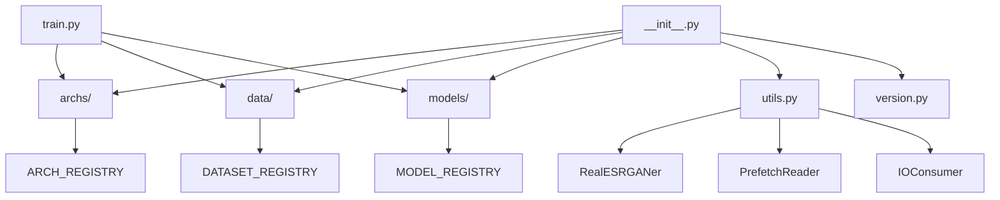
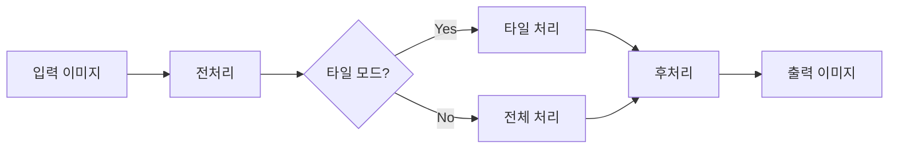
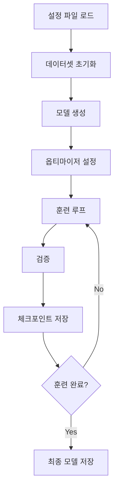

# Real-ESRGAN 모듈 완전 분석 가이드

# 📚 문서 연결성 (Document Hierarchy)

**📍 현재 위치**: L2 - RealESRGANer 패키지 가이드
**🔗 상위 문서**: [L0 - CLAUDE.md](../CLAUDE.md) - Real-ESRGAN 프로젝트 전체 가이드
**🔗 관련 상위 문서**: 
- [L1 - 추론 시스템 가이드](../inference_context.md) - 이 패키지를 활용하는 추론 시스템
- [L1 - 테스트 시스템 가이드](../tests/TESTS.md) - 이 패키지를 검증하는 테스트 시스템
**📂 하위 문서**: 
- [L2 - 아키텍처 분석](./archs/archs_context.md) - 사용되는 신경망 구조들
- [L2 - 데이터 시스템](./data/data_context.md) - 데이터 로딩 및 처리 시스템
- [L2 - 모델 시스템](./models/models_context.md) - 훈련 및 추론 모델들

---

## 📋 목차
1. [Real-ESRGAN 모듈 개요](#real-esrgan-모듈-개요)
2. [패키지 구조 분석](#패키지-구조-분석)
3. [각 파일별 상세 분석](#각-파일별-상세-분석)
4. [핵심 유틸리티 분석](#핵심-유틸리티-분석)
5. [훈련 스크립트 분석](#훈련-스크립트-분석)
6. [하위 모듈 상세 분석](#하위-모듈-상세-분석)
7. [사용 방법 및 예시](#사용-방법-및-예시)
8. [확장성 및 커스터마이징](#확장성-및-커스터마이징)
9. [개발 가이드](#개발-가이드)
10. [성능 최적화](#성능-최적화)

---

## 🔍 Real-ESRGAN 모듈 개요

Real-ESRGAN (Real-Enhanced Super-Resolution Generative Adversarial Networks)은 실용적인 이미지 복원 및 초해상도 향상을 위한 딥러닝 패키지입니다. 이 모듈은 실제 저품질 이미지의 복원에 특화되어 있으며, 블라인드 초해상도(Blind Super-Resolution) 기법을 활용합니다.

### 🎯 핵심 목표
- **실용성**: 실제 환경의 다양한 열화 패턴에 대응
- **품질**: 고품질 초해상도 이미지 생성
- **효율성**: 메모리 효율적인 대용량 이미지 처리
- **확장성**: 다양한 네트워크 아키텍처 지원

### 🌟 주요 특징
1. **실제 이미지 특화**: 합성 데이터가 아닌 실제 저품질 이미지 복원에 최적화
2. **블라인드 초해상도**: 알려지지 않은 열화 과정에서도 효과적인 복원
3. **타일 기반 처리**: GPU 메모리 제한을 극복한 대용량 이미지 처리
4. **다양한 포맷 지원**: RGB, RGBA, 그레이스케일, 16비트 이미지 지원
5. **플러그인 시스템**: 새로운 아키텍처와 모델의 쉬운 추가

---

## 🏗️ 패키지 구조 분석

```
realesrgan/
├── __init__.py           # 📦 패키지 초기화 및 통합 인터페이스
├── version.py            # 🔢 버전 정보 관리
├── train.py             # 🎯 훈련 스크립트 (BasicSR 연동)
├── utils.py             # 🔧 핵심 유틸리티 (RealESRGANer 클래스)
├── archs/               # 🧠 신경망 아키텍처 모듈
│   ├── __init__.py      # 자동 아키텍처 등록 시스템
│   ├── discriminator_arch.py  # UNet 기반 판별기
│   └── srvgg_arch.py    # 경량화 SRVgg 생성기
├── data/                # 📊 데이터셋 및 데이터 로더
│   ├── __init__.py      # 자동 데이터셋 등록 시스템
│   ├── realesrgan_dataset.py      # 실시간 열화 데이터셋
│   └── realesrgan_paired_dataset.py  # GT-LQ 페어 데이터셋
└── models/              # 🎭 모델 정의 및 훈련 로직
    ├── __init__.py      # 자동 모델 등록 시스템
    ├── realesrgan_model.py   # GAN 기반 완전 모델
    └── realesrnet_model.py   # MSE 기반 베이스 모델
```

### 🔄 모듈 간 상호작용



---

## 📄 각 파일별 상세 분석

### 1. `__init__.py` - 패키지 초기화 모듈

**역할**: Real-ESRGAN 패키지의 진입점이자 통합 인터페이스

```python
# 모든 하위 모듈의 공개 API 통합
from .archs import *      # 아키텍처 클래스들
from .data import *       # 데이터셋 클래스들  
from .models import *     # 모델 클래스들
from .utils import *      # 유틸리티 함수들
from .version import *    # 버전 정보
```

**주요 기능**:
- 하위 모듈들의 자동 임포트 및 네임스페이스 통합
- 외부에서 단일 진입점을 통한 접근 제공
- 패키지 레벨에서의 일관된 API 인터페이스 제공

### 2. `version.py` - 버전 정보 모듈

**역할**: 패키지의 버전 정보와 메타데이터 관리

```python
__version__ = '0.3.0'        # 시맨틱 버저닝
__gitsha__ = 'a4abfb2'       # Git 커밋 해시
version_info = (0, 3, 0)     # 튜플 형식 버전
```

**주요 특징**:
- **자동 생성**: 빌드 시 자동으로 업데이트
- **시맨틱 버저닝**: MAJOR.MINOR.PATCH 형식
- **Git 통합**: 커밋 해시를 통한 정확한 버전 추적
- **호환성 정보**: Python, PyTorch, CUDA 지원 버전 명시

### 3. `train.py` - 훈련 스크립트

**역할**: Real-ESRGAN 모델의 훈련을 위한 메인 스크립트

```python
# BasicSR 프레임워크와 완전 통합
from basicsr.train import train_pipeline

# Real-ESRGAN 특화 컴포넌트 등록
import realesrgan.archs
import realesrgan.data  
import realesrgan.models

# 메인 훈련 파이프라인 실행
root_path = osp.abspath(osp.join(__file__, osp.pardir, osp.pardir))
train_pipeline(root_path)
```

**핵심 특징**:
- **BasicSR 통합**: 검증된 훈련 프레임워크 활용
- **모듈화**: 각 컴포넌트의 독립적 관리
- **설정 파일 기반**: YAML을 통한 유연한 파라미터 관리
- **확장성**: 새로운 컴포넌트 자동 인식

### 4. `utils.py` - 핵심 유틸리티 모듈

**역할**: Real-ESRGAN의 핵심 기능을 제공하는 유틸리티 클래스 집합

**주요 클래스**:
- `RealESRGANer`: 메인 초해상도 처리 엔진
- `PrefetchReader`: 멀티스레딩 이미지 프리로딩
- `IOConsumer`: 비동기 이미지 저장 처리

---

## 🔧 핵심 유틸리티 분석

### RealESRGANer 클래스 상세 분석

`RealESRGANer`는 Real-ESRGAN 패키지의 심장부로, 사전 훈련된 모델을 사용하여 이미지 초해상도를 수행하는 메인 인터페이스입니다.

#### 🏗️ 클래스 구조

```python
class RealESRGANer():
    def __init__(self, scale, model_path, dni_weight=None, model=None, 
                 tile=0, tile_pad=10, pre_pad=10, half=False, 
                 device=None, gpu_id=None)
```

#### 📋 주요 매개변수

| 매개변수 | 타입 | 설명 | 기본값 |
|---------|------|------|-------|
| `scale` | int | 업스케일링 배율 (2 또는 4) | 필수 |
| `model_path` | str/list | 모델 파일 경로 또는 URL | 필수 |
| `dni_weight` | list | Deep Network Interpolation 가중치 | None |
| `model` | nn.Module | 네트워크 모델 인스턴스 | None |
| `tile` | int | 타일 크기 (0이면 비활성화) | 0 |
| `tile_pad` | int | 타일 패딩 크기 | 10 |
| `pre_pad` | int | 전처리 패딩 크기 | 10 |
| `half` | bool | FP16 정밀도 사용 여부 | False |
| `device` | torch.device | 연산 장치 | None (자동) |
| `gpu_id` | int | 특정 GPU ID | None |

#### 🔄 처리 파이프라인



#### 📊 주요 메서드 분석

##### 1. `enhance()` - 메인 처리 메서드
```python
@torch.no_grad()
def enhance(self, img, outscale=None, alpha_upsampler='realesrgan'):
    """
    이미지 초해상도 처리의 메인 함수
    
    Args:
        img (numpy.ndarray): 입력 이미지 (H, W, C)
        outscale (float): 출력 스케일 (None이면 모델 스케일 사용)
        alpha_upsampler (str): 알파 채널 업샘플러 ('realesrgan' 또는 'cv2')
    
    Returns:
        tuple: (처리된 이미지, 이미지 모드)
    """
```

**처리 과정**:
1. **이미지 포맷 감지**: RGB, RGBA, 그레이스케일, 16비트 판별
2. **전처리**: 정규화, 패딩, 텐서 변환
3. **모델 추론**: GPU/CPU에서 신경망 실행
4. **후처리**: 패딩 제거, 색공간 변환, 스케일 조정
5. **알파 채널 처리**: RGBA 이미지의 투명도 복원

##### 2. `tile_process()` - 타일 기반 처리
```python
def tile_process(self):
    """
    대용량 이미지를 위한 타일 기반 처리
    
    작동 원리:
    1. 이미지를 tile_size 크기의 타일로 분할
    2. 각 타일에 tile_pad 만큼 패딩 추가 (경계 아티팩트 방지)
    3. 타일별로 독립적인 모델 추론 수행
    4. 처리된 타일들을 하나의 이미지로 병합
    """
```

**메모리 최적화**:
- GPU 메모리 제한 극복
- 임의 크기 이미지 처리 가능
- 패딩을 통한 경계 아티팩트 최소화

##### 3. `dni()` - Deep Network Interpolation
```python
def dni(self, net_a, net_b, dni_weight, key='params', loc='cpu'):
    """
    두 네트워크 가중치의 선형 보간
    
    목적: 서로 다른 특성의 모델들을 혼합하여 균형 잡힌 결과 생성
    예: 디테일 복원 모델 + 노이즈 제거 모델
    """
```

#### 🎛️ 성능 최적화 기능

1. **GPU 가속**: CUDA 자동 감지 및 활용
2. **Mixed Precision**: FP16 지원으로 메모리 사용량 50% 절약
3. **타일 처리**: 메모리 제한 없는 초고해상도 이미지 처리
4. **배치 처리**: 여러 이미지 동시 처리 지원

#### 🔍 지원 이미지 포맷

| 포맷 | 비트 심도 | 채널 | 처리 방식 |
|------|-----------|------|-----------|
| RGB | 8/16-bit | 3 | 직접 처리 |
| RGBA | 8/16-bit | 4 | RGB + 알파 분리 처리 |
| 그레이스케일 | 8/16-bit | 1 | RGB로 변환 후 처리 |

### PrefetchReader 클래스

**목적**: 멀티스레딩을 통한 이미지 사전 로딩으로 I/O 병목 해결

```python
class PrefetchReader(threading.Thread):
    def __init__(self, img_list, num_prefetch_queue):
        # Queue 기반 프리로딩 시스템
        self.que = queue.Queue(num_prefetch_queue)
        self.img_list = img_list
```

**장점**:
- I/O 대기 시간 최소화
- CPU와 GPU 리소스 효율적 활용
- 대용량 배치 처리 시 성능 향상

### IOConsumer 클래스

**목적**: 비동기 이미지 저장으로 처리 성능 최적화

```python
class IOConsumer(threading.Thread):
    def run(self):
        while True:
            msg = self._queue.get()
            if isinstance(msg, str) and msg == 'quit':
                break
            output = msg['output']
            save_path = msg['save_path']
            cv2.imwrite(save_path, output)
```

**특징**:
- 멀티 워커 지원
- 큐 기반 태스크 관리
- 안전한 스레드 종료 메커니즘

---

## 🎯 훈련 스크립트 분석

### 훈련 파이프라인 구조

Real-ESRGAN의 `train.py`는 BasicSR 프레임워크를 기반으로 한 완전 통합 훈련 시스템입니다.

#### 🔄 훈련 과정 흐름



#### ⚙️ 설정 파일 구조

```yaml
# 네트워크 아키텍처 설정
network_g:
  type: SRVGGNetCompact
  num_in_ch: 3
  num_out_ch: 3
  num_feat: 64
  num_conv: 32

network_d:
  type: UNetDiscriminatorSN
  num_in_ch: 3
  num_feat: 64

# 데이터셋 설정  
datasets:
  train:
    name: RealESRGAN
    type: RealESRGANDataset
    dataroot_gt: datasets/DIV2K/DIV2K_train_HR_sub
    io_backend:
      type: disk

# 훈련 파라미터
train:
  optim_g:
    type: Adam
    lr: !!float 1e-4
    weight_decay: 0
    betas: [0.9, 0.99]
    
  optim_d:
    type: Adam  
    lr: !!float 1e-4
    weight_decay: 0
    betas: [0.9, 0.99]
```

#### 🎓 손실 함수 구성

1. **생성기 손실**:
   - L1 Loss: 픽셀 단위 재구성 오차
   - Perceptual Loss: VGG 기반 지각적 품질
   - GAN Loss: 판별기와의 적대적 학습

2. **판별기 손실**:
   - Real/Fake 분류 손실
   - Gradient Penalty (선택적)

#### 📊 훈련 모니터링

- **실시간 로그**: 손실값, 학습률, GPU 사용률
- **시각화**: 훈련/검증 이미지 샘플
- **체크포인트**: 주기적 모델 저장 및 복구
- **조기 종료**: 검증 성능 기반 자동 중단

---

## 🏗️ 하위 모듈 상세 분석

### archs/ - 네트워크 아키텍처 모듈

#### 자동 등록 시스템
```python
# archs/__init__.py
arch_folder = osp.dirname(osp.abspath(__file__))
arch_filenames = [osp.splitext(osp.basename(v))[0] 
                  for v in scandir(arch_folder) 
                  if v.endswith('_arch.py')]
_arch_modules = [importlib.import_module(f'realesrgan.archs.{file_name}') 
                 for file_name in arch_filenames]
```

**동작 원리**:
1. `archs/` 폴더에서 `*_arch.py` 파일들을 자동 검색
2. 동적으로 모듈을 임포트
3. 각 모듈의 `@ARCH_REGISTRY.register()` 데코레이터 실행
4. 레지스트리에 아키텍처 클래스 등록

#### 포함된 아키텍처

##### 1. SRVGGNetCompact (srvgg_arch.py)
- **용도**: 경량화 초해상도 생성기
- **특징**: 
  - VGG 스타일 컨볼루션 블록
  - 파라미터 효율성
  - 빠른 추론 속도
- **적용**: 실시간 처리용 모델

##### 2. UNetDiscriminatorSN (discriminator_arch.py)  
- **용도**: U-Net 기반 패치 판별기
- **특징**:
  - Spectral Normalization 적용
  - 다단계 특징 추출
  - 안정적인 GAN 훈련
- **적용**: Real-ESRGAN 모델의 판별기

### data/ - 데이터셋 모듈

#### 자동 등록 시스템
```python
# data/__init__.py  
data_folder = osp.dirname(osp.abspath(__file__))
dataset_filenames = [osp.splitext(osp.basename(v))[0] 
                     for v in scandir(data_folder) 
                     if v.endswith('_dataset.py')]
_dataset_modules = [importlib.import_module(f'realesrgan.data.{file_name}') 
                    for file_name in dataset_filenames]
```

#### 포함된 데이터셋

##### 1. RealESRGANDataset (realesrgan_dataset.py)
**특징**:
- **실시간 열화 생성**: 고해상도 이미지에서 실시간으로 저해상도 생성
- **다양한 열화 모델링**: 
  - 가우시안 노이즈
  - JPEG 압축
  - 블러 효과
  - 샤프닝
  - 색공간 변환

**데이터 증강**:
```python
# 랜덤 열화 파이프라인
transforms = [
    RandomResize(),           # 랜덤 리사이징
    RandomNoise(),           # 노이즈 추가
    RandomJPEGCompression(), # JPEG 압축
    RandomBlur(),            # 블러 효과
    RandomSharpen(),         # 샤프닝
]
```

##### 2. RealESRGANPairedDataset (realesrgan_paired_dataset.py)
**특징**:
- **GT-LQ 쌍 데이터**: 미리 준비된 고해상도-저해상도 이미지 쌍 사용
- **안정적인 훈련**: 일관된 데이터 품질 보장
- **빠른 로딩**: 전처리가 완료된 데이터 사용

### models/ - 모델 모듈

#### 자동 등록 시스템
```python
# models/__init__.py
model_folder = osp.dirname(osp.abspath(__file__))
model_filenames = [osp.splitext(osp.basename(v))[0] 
                   for v in scandir(model_folder) 
                   if v.endswith('_model.py')]
_model_modules = [importlib.import_module(f'realesrgan.models.{file_name}') 
                  for file_name in model_filenames]
```

#### 포함된 모델

##### 1. RealESRGANModel (realesrgan_model.py)
**완전한 GAN 기반 모델**:
- **생성기**: 초해상도 이미지 생성
- **판별기**: 실제/가짜 이미지 구분
- **손실 함수**: L1 + Perceptual + GAN Loss
- **최적화**: 생성기-판별기 교대 훈련

**훈련 과정**:
```python
# 생성기 업데이트
l_g_total = l_g_pix + l_g_percep + l_g_gan
self.optimizer_g.zero_grad()
l_g_total.backward()
self.optimizer_g.step()

# 판별기 업데이트  
l_d_total = l_d_real + l_d_fake
self.optimizer_d.zero_grad()
l_d_total.backward()
self.optimizer_d.step()
```

##### 2. RealESRNetModel (realesrnet_model.py)
**MSE 기반 베이스 모델**:
- **단순한 구조**: 생성기만 사용
- **L1/L2 손실**: 픽셀 레벨 재구성 중심
- **안정적 훈련**: GAN 불안정성 없음
- **사전 훈련**: RealESRGAN의 초기 가중치로 활용

---

## 💡 사용 방법 및 예시

### 기본 사용법

#### 1. 단일 이미지 처리
```python
import cv2
from realesrgan import RealESRGANer
from realesrgan.archs.srvgg_arch import SRVGGNetCompact

# 모델 초기화
model = SRVGGNetCompact(num_in_ch=3, num_out_ch=3, num_feat=64, 
                        num_conv=32, upscale=4, act_type='prelu')
upsampler = RealESRGANer(
    scale=4,
    model_path='https://github.com/xinntao/Real-ESRGAN/releases/download/v0.2.1/RealESRGAN_x4plus.pth',
    model=model,
    tile=0,
    tile_pad=10,
    pre_pad=0,
    half=False  # GPU 메모리가 부족하면 True로 설정
)

# 이미지 로드 및 처리
img = cv2.imread('input.jpg', cv2.IMREAD_UNCHANGED)
output, _ = upsampler.enhance(img, outscale=4)

# 결과 저장
cv2.imwrite('output.jpg', output)
```

#### 2. 배치 처리
```python
import os
from realesrgan.utils import PrefetchReader, IOConsumer
import queue

# 입력 이미지 목록
img_list = [os.path.join('input_dir', f) for f in os.listdir('input_dir')]

# 프리로더 초기화
prefetch_reader = PrefetchReader(img_list, num_prefetch_queue=5)
prefetch_reader.start()

# I/O 워커 초기화
save_queue = queue.Queue()
io_worker = IOConsumer(opt={'output_dir': 'output_dir'}, que=save_queue, qid=0)
io_worker.start()

# 배치 처리
for img_path in img_list:
    img = next(prefetch_reader)
    if img is not None:
        output, _ = upsampler.enhance(img)
        save_path = os.path.join('output_dir', os.path.basename(img_path))
        save_queue.put({'output': output, 'save_path': save_path})

# 워커 종료
save_queue.put('quit')
io_worker.join()
```

#### 3. 타일 처리 (대용량 이미지)
```python
# 대용량 이미지를 위한 타일 설정
upsampler = RealESRGANer(
    scale=4,
    model_path='model.pth',
    model=model,
    tile=512,        # 타일 크기 (GPU 메모리에 따라 조정)
    tile_pad=10,     # 타일 패딩
    pre_pad=0,
    half=True        # FP16으로 메모리 절약
)

# 초고해상도 이미지 처리
large_img = cv2.imread('large_image.jpg', cv2.IMREAD_UNCHANGED)
output, _ = upsampler.enhance(large_img)
cv2.imwrite('large_output.jpg', output)
```

### 고급 사용법

#### 1. Deep Network Interpolation
```python
# 두 모델의 가중치 혼합
upsampler = RealESRGANer(
    scale=4,
    model_path=['model_A.pth', 'model_B.pth'],
    dni_weight=[0.7, 0.3],  # 70% A + 30% B
    model=model
)
```

#### 2. 알파 채널 처리
```python
# RGBA 이미지 처리
rgba_img = cv2.imread('image_with_alpha.png', cv2.IMREAD_UNCHANGED)
output, img_mode = upsampler.enhance(
    rgba_img, 
    alpha_upsampler='realesrgan'  # 또는 'cv2'
)

if img_mode == 'RGBA':
    # 투명도가 있는 PNG로 저장
    cv2.imwrite('output_rgba.png', output)
```

#### 3. 16비트 이미지 처리
```python
# 16비트 이미지 지원
img_16bit = cv2.imread('image_16bit.png', cv2.IMREAD_UNCHANGED)
if img_16bit.dtype == np.uint16:
    output, _ = upsampler.enhance(img_16bit)
    # 출력도 16비트로 저장됨
    cv2.imwrite('output_16bit.png', output)
```

---

## 🔧 확장성 및 커스터마이징

### 새로운 아키텍처 추가

#### 1. 아키텍처 파일 생성
```python
# realesrgan/archs/custom_arch.py
from basicsr.utils.registry import ARCH_REGISTRY
import torch.nn as nn

@ARCH_REGISTRY.register()
class CustomSRNet(nn.Module):
    def __init__(self, num_in_ch=3, num_out_ch=3, num_feat=64, scale=4):
        super(CustomSRNet, self).__init__()
        # 커스텀 아키텍처 구현
        self.conv1 = nn.Conv2d(num_in_ch, num_feat, 3, 1, 1)
        self.conv2 = nn.Conv2d(num_feat, num_out_ch * scale**2, 3, 1, 1)
        self.pixel_shuffle = nn.PixelShuffle(scale)
        
    def forward(self, x):
        x = self.conv1(x)
        x = self.conv2(x)
        return self.pixel_shuffle(x)
```

#### 2. 자동 등록 확인
```python
from realesrgan import *
from basicsr.utils.registry import ARCH_REGISTRY

# 등록된 아키텍처 확인
print(ARCH_REGISTRY._obj_map.keys())  # CustomSRNet이 포함되어야 함
```

### 새로운 데이터셋 추가

#### 1. 데이터셋 클래스 생성
```python
# realesrgan/data/custom_dataset.py
from basicsr.utils.registry import DATASET_REGISTRY
from torch.utils.data import Dataset

@DATASET_REGISTRY.register()
class CustomDataset(Dataset):
    def __init__(self, opt):
        super(CustomDataset, self).__init__()
        self.opt = opt
        # 데이터셋 초기화
        
    def __getitem__(self, index):
        # 데이터 로딩 및 전처리
        return {'lq': lq_img, 'gt': gt_img}
        
    def __len__(self):
        return len(self.data_list)
```

#### 2. 설정 파일에서 사용
```yaml
datasets:
  train:
    name: CustomTrain
    type: CustomDataset
    # 커스텀 파라미터들
    custom_param: value
```

### 새로운 모델 추가

#### 1. 모델 클래스 생성
```python
# realesrgan/models/custom_model.py
from basicsr.utils.registry import MODEL_REGISTRY
from basicsr.models.sr_model import SRModel

@MODEL_REGISTRY.register()
class CustomSRModel(SRModel):
    def __init__(self, opt):
        super(CustomSRModel, self).__init__(opt)
        # 커스텀 손실 함수 등 추가
        
    def optimize_parameters(self, current_iter):
        # 커스텀 최적화 로직
        super().optimize_parameters(current_iter)
```

---

## 🚀 개발 가이드

### 개발 환경 설정

#### 1. 의존성 설치
```bash
# 기본 의존성
pip install torch torchvision opencv-python numpy

# BasicSR 프레임워크
pip install basicsr

# 개발 도구
pip install pytest black flake8
```

#### 2. 프로젝트 구조 이해
```
Real-ESRGAN/
├── realesrgan/          # 메인 패키지
├── options/             # 훈련/테스트 설정 파일
├── weights/             # 사전 훈련된 모델
├── datasets/            # 훈련 데이터셋
├── experiments/         # 실험 결과
└── tests/               # 단위 테스트
```

### 코딩 스타일 가이드

#### 1. 네이밍 컨벤션
```python
# 클래스: PascalCase
class RealESRGANer:

# 함수/변수: snake_case  
def enhance_image():
    tile_size = 512

# 상수: UPPER_CASE
MAX_TILE_SIZE = 1024
```

#### 2. 문서화 스타일
```python
def enhance(self, img, outscale=None):
    """이미지 초해상도 처리
    
    Args:
        img (numpy.ndarray): 입력 이미지 (H, W, C)
        outscale (float, optional): 출력 배율. Defaults to None.
        
    Returns:
        tuple: (처리된 이미지, 이미지 모드)
        
    Raises:
        RuntimeError: GPU 메모리 부족 시
    """
```

### 테스트 가이드라인

#### 1. 단위 테스트
```python
# tests/test_utils.py
import pytest
import numpy as np
from realesrgan.utils import RealESRGANer

def test_enhance_basic():
    # 테스트용 더미 이미지
    img = np.random.rand(64, 64, 3).astype(np.uint8)
    
    # RealESRGANer 인스턴스 생성 (테스트용 모델)
    upsampler = RealESRGANer(
        scale=2,
        model_path='test_model.pth',
        model=test_model
    )
    
    # 처리 테스트
    output, img_mode = upsampler.enhance(img)
    
    # 검증
    assert output.shape[0] == img.shape[0] * 2
    assert output.shape[1] == img.shape[1] * 2
    assert img_mode == 'RGB'
```

#### 2. 통합 테스트
```bash
# 전체 테스트 실행
python -m pytest tests/ -v

# 특정 테스트만 실행
python -m pytest tests/test_utils.py::test_enhance_basic -v

# 커버리지 측정
python -m pytest --cov=realesrgan tests/
```

### 기여 가이드라인

#### 1. Git 워크플로우
```bash
# 개발 브랜치 생성
git checkout -b feature/new-architecture

# 변경사항 커밋
git add .
git commit -m "Add new CustomSR architecture"

# Pull Request 생성
git push origin feature/new-architecture
```

#### 2. 코드 리뷰 체크리스트
- [ ] 코딩 스타일 준수 (black, flake8)
- [ ] 단위 테스트 추가/수정
- [ ] 문서 업데이트
- [ ] 성능 영향 분석
- [ ] 호환성 확인

---

## ⚡ 성능 최적화

### GPU 메모리 최적화

#### 1. Half Precision 사용
```python
# FP16으로 메모리 사용량 50% 절약
upsampler = RealESRGANer(
    scale=4,
    model_path='model.pth',
    model=model,
    half=True  # FP16 활성화
)
```

#### 2. 타일 크기 최적화
```python
# GPU 메모리에 따른 권장 타일 크기
gpu_memory_gb = torch.cuda.get_device_properties(0).total_memory / 1e9

if gpu_memory_gb >= 24:
    tile_size = 1024
elif gpu_memory_gb >= 16:
    tile_size = 512
elif gpu_memory_gb >= 8:
    tile_size = 256
else:
    tile_size = 128
    
upsampler = RealESRGANer(
    scale=4,
    model_path='model.pth',
    model=model,
    tile=tile_size
)
```

### 처리 속도 최적화

#### 1. 멀티스레딩 I/O
```python
import threading
from concurrent.futures import ThreadPoolExecutor

def process_image_async(img_path, output_dir):
    img = cv2.imread(img_path)
    output, _ = upsampler.enhance(img)
    output_path = os.path.join(output_dir, os.path.basename(img_path))
    cv2.imwrite(output_path, output)

# 병렬 처리
with ThreadPoolExecutor(max_workers=4) as executor:
    futures = [executor.submit(process_image_async, img_path, 'output/')
               for img_path in img_list]
    
    for future in futures:
        future.result()
```

#### 2. 배치 처리 최적화
```python
# 작은 이미지들을 배치로 묶어서 처리
def batch_process(img_list, batch_size=4):
    for i in range(0, len(img_list), batch_size):
        batch = img_list[i:i+batch_size]
        
        # 배치를 하나의 텐서로 결합
        batch_tensor = torch.cat([preprocess(img) for img in batch])
        
        # 배치 추론
        with torch.no_grad():
            output_batch = model(batch_tensor)
            
        # 개별 결과로 분리
        outputs = torch.chunk(output_batch, len(batch))
        
        for j, output in enumerate(outputs):
            save_image(output, f'output_{i+j}.jpg')
```

### 메모리 사용량 모니터링

#### 1. GPU 메모리 추적
```python
def monitor_gpu_memory():
    if torch.cuda.is_available():
        allocated = torch.cuda.memory_allocated() / 1e9
        cached = torch.cuda.memory_reserved() / 1e9
        print(f"GPU Memory - Allocated: {allocated:.2f} GB, Cached: {cached:.2f} GB")

# 처리 전후 메모리 확인
monitor_gpu_memory()
output, _ = upsampler.enhance(img)
monitor_gpu_memory()
```

#### 2. 메모리 정리
```python
# 처리 완료 후 메모리 정리
torch.cuda.empty_cache()  # GPU 캐시 정리
import gc
gc.collect()              # Python 가비지 컬렉션
```

---

## 📚 추가 리소스

### 공식 문서 및 저장소
- **GitHub**: https://github.com/xinntao/Real-ESRGAN
- **Paper**: "Real-ESRGAN: Training Real-World Blind Super-Resolution with Pure Synthetic Data"
- **BasicSR Framework**: https://github.com/XPixelGroup/BasicSR

### 사전 훈련된 모델
- **RealESRGAN_x4plus**: 일반적인 사진용 4배 업스케일링
- **RealESRGAN_x4plus_anime_6B**: 애니메이션/일러스트 특화
- **RealESRGANv2**: 향상된 버전 2

### 커뮤니티 및 지원
- **Issues**: GitHub Issues를 통한 버그 리포트
- **Discussions**: 커뮤니티 토론 및 질문
- **Examples**: 다양한 사용 예시 및 튜토리얼

---

*이 문서는 Real-ESRGAN v0.3.0 기준으로 작성되었습니다. 최신 버전과 차이가 있을 수 있으니 공식 문서를 참조하시기 바랍니다.*